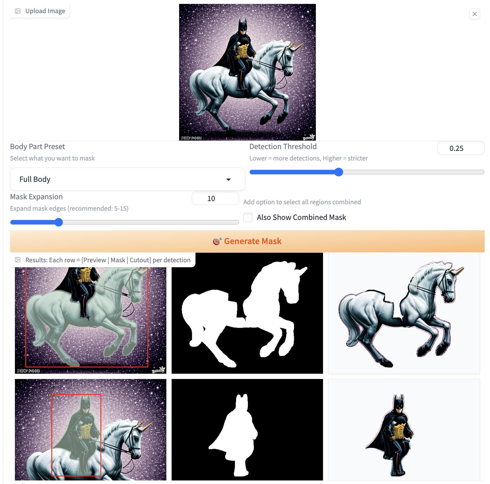

# Quick Segment for Stable Diffusion WebUI

**Simplified fork focusing on quick segmentation using SAM (Segment Anything Model) and GroundingDINO.**

This extension provides an easy-to-use interface for detecting and masking objects, body parts, clothing, and faces using AI-powered segmentation. Perfect for creating masks to use with img2img inpainting or other image editing workflows.



## Features

- **Quick Object Detection** - One-click detection of:
  - Full body, upper/lower body
  - Face and facial features
  - Hands and feet
  - Clothing items (shirts, pants, dresses, etc.)
  - Background
  - Custom object detection via text prompts

- **AI-Powered Segmentation** - Uses state-of-the-art models:
  - SAM (Segment Anything Model) for precise mask generation
  - GroundingDINO for text-based object detection
  - Multiple SAM model options (standard, HQ, mobile)

- **Simple Workflow**:
  1. Upload your image
  2. Select a preset (or enter custom prompt)
  3. Click "Generate Mask"
  4. Select the best mask from the results
  5. Click "Send to Inpaint Upload" to start editing immediately

- **Mask Customization**:
  - Adjustable detection threshold
  - Mask expansion/dilation
  - Combined mask option for multiple detections
  - Invert mask option (great for background replacement)

## How to Use

1. **Open the extension** in txt2img or img2img tabs (look for "Quick Segment" accordion)
2. **Select SAM model** from the dropdown (will auto-download if not present)
3. **Upload your image**
4. **Choose a preset** from the dropdown:
   - Full Body, Upper/Lower Body
   - Face, Eyes, Nose, Mouth, Ears
   - Hands, Feet
   - Shirts, Pants, Dress, Shoes
   - Or select "Custom" to enter your own text prompt
5. **Adjust settings** (optional):
   - Detection Threshold: Lower = more detections, Higher = stricter
   - Mask Expansion: Expand mask edges (5-15 pixels recommended)
   - Also Show Combined Mask: Adds an option to combine all detected regions
6. **Click "Generate Mask"** and wait for results
7. **View results** in the gallery:
   - Each row shows: [Preview | Mask | Cutout] for each detection
8. **Send to Inpaint**:
   - Select the best mask using the radio buttons below the gallery
   - (Optional) Check **"Invert Mask"** if you want to replace the background instead of the subject
   - Click **"📋 Send to Inpaint Upload"**
   - The extension will automatically switch you to the **Inpaint Upload** tab with your image and mask ready to go!


## Installation

```bash
cd ${sd-webui}/extensions
git clone https://github.com/dmikey/sd-webui-quick-segment
```

Or install via the WebUI Extensions tab.

Choose one or more of the models below and put them to `${sd-webui}/models/sam` or `${sd-webui-quick-segment}/models/sam`. **Do not change model name, otherwise this extension may fail due to a bug inside segment anything.**

### Supported SAM Models

1. [SAM](https://github.com/facebookresearch/segment-anything) from Meta AI.
    - [2.56GB sam_vit_h](https://dl.fbaipublicfiles.com/segment_anything/sam_vit_h_4b8939.pth)
    - [1.25GB sam_vit_l](https://dl.fbaipublicfiles.com/segment_anything/sam_vit_l_0b3195.pth)
    - [375MB sam_vit_b](https://dl.fbaipublicfiles.com/segment_anything/sam_vit_b_01ec64.pth)

2. [SAM-HQ](https://github.com/SysCV/sam-hq) from SysCV.
    - [2.57GB sam_hq_vit_h](https://huggingface.co/lkeab/hq-sam/resolve/main/sam_hq_vit_h.pth)
    - [1.25GB sam_hq_vit_l](https://huggingface.co/lkeab/hq-sam/resolve/main/sam_hq_vit_l.pth)
    - [379MB sam_hq_vit_b](https://huggingface.co/lkeab/hq-sam/resolve/main/sam_hq_vit_b.pth)

3. [MobileSAM](https://github.com/ChaoningZhang/MobileSAM) from Kyung Hee University.
    - [39MB mobile_sam](https://github.com/ChaoningZhang/MobileSAM/blob/master/weights/mobile_sam.pt)

GroundingDINO models will be automatically downloaded on first use.

## Troubleshooting

**GroundingDINO Installation Issues:**
- This extension uses local GroundingDINO by default to avoid C++/CUDA compilation issues
- If you encounter errors, go to Settings → Quick Segment → Enable "Use local groundingdino"
- Models are auto-downloaded from HuggingFace on first use

**MPS/Apple Silicon Issues:**
- If you encounter MPS errors on Mac, try launching with: `export PYTORCH_ENABLE_MPS_FALLBACK=1`
- Or enable "Use CPU for SAM" checkbox in the UI (slower but more stable)

**Memory Issues:**
- Use smaller SAM models (sam_vit_b or mobile_sam) if you run out of VRAM
- Lower the detection threshold to get fewer detections

## Contributing

If you encounter a bug, please [submit an issue](https://github.com/dmikey/sd-webui-quick-segment/issues). Please include your WebUI version, extension version, browser version, and any relevant error logs.

Pull requests are welcome!

## Credits

This is a simplified fork of [sd-webui-segment-anything](https://github.com/continue-revolution/sd-webui-segment-anything) by continue-revolution.
